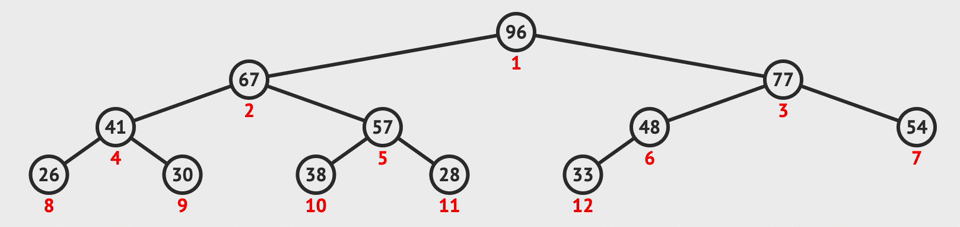
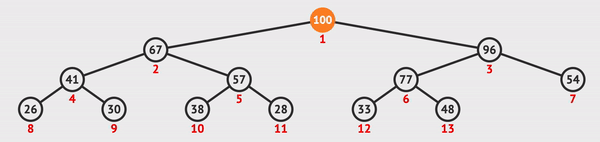

# Binary_Heaps_Data_Structure


> ## 🤯 Max Binary Heap: :octocat:

``` js
class MaxBinaryHeap {
    constructor(){
        this.values = [];
    }
    insert(element){
        this.values.push(element);
        this.bubbleUp();
    }
    bubbleUp(){
        let idx = this.values.length - 1;
        const element = this.values[idx];
        while(idx > 0){
            let parentIdx = Math.floor((idx - 1)/2);
            let parent = this.values[parentIdx];
            if(element <= parent) break;
            this.values[parentIdx] = element;
            this.values[idx] = parent;
            idx = parentIdx;
        }
    }

    extractMax(){
        const max = this.values[0];
        const end = this.values.pop();
        if(this.values.length > 0){
            this.values[0] = end;
            this.sinkDown();
        }
        return max;
    }


    sinkDown(){
        let idx = 0;
        const length = this.values.length;
        const element = this.values[0];
        while(true){
            let leftChildIdx = 2 * idx + 1;
            let rightChildIdx = 2 * idx + 2;
            let leftChild,rightChild;
            let swap = null;

            if(leftChildIdx < length){
                leftChild = this.values[leftChildIdx];
                if(leftChild > element) {
                    swap = leftChildIdx;
                }
            }
            if(rightChildIdx < length){
                rightChild = this.values[rightChildIdx];
                if(
                    (swap === null && rightChild > element) || 
                    (swap !== null && rightChild > leftChild)
                ) {
                   swap = rightChildIdx;
                }
            }
            if(swap === null) break;
            this.values[idx] = this.values[swap];
            this.values[swap] = element;
            idx = swap;
        }
    }
}

let heap = new MaxBinaryHeap();
heap.insert(41);
heap.insert(39);
heap.insert(33);
heap.insert(18);
heap.insert(27);
heap.insert(12);
heap.insert(55);
console.log(heap)
// MaxBinaryHeap { values: [
//     55, 39, 41, 18,
//     27, 12, 33
//   ] }
console.log(heap.extractMax()) // 55
console.log(heap) // MaxBinaryHeap { values: [ 41, 39, 33, 18, 27, 12 ] }
heap.extractMax()
heap.extractMax()
heap.extractMax()
heap.extractMax()
heap.extractMax()
heap.extractMax()
console.log(heap) // MaxBinaryHeap { values: [] }
```






> ## 🤯 Priority Queue: :octocat:
``` js
class PriorityQueue {
    constructor(){
        this.values = [];
    }
    enqueue(val, priority){
        let newNode = new Node(val, priority);
        this.values.push(newNode);
        this.bubbleUp();
    }

    bubbleUp(){
        let idx = this.values.length - 1;
        const element = this.values[idx];
        while(idx > 0){
            let parentIdx = Math.floor((idx - 1)/2);
            let parent = this.values[parentIdx];
            if(element.priority >= parent.priority) break;
            this.values[parentIdx] = element;
            this.values[idx] = parent;
            idx = parentIdx;
        }
    }

    dequeue(){
        const min = this.values[0];
        const end = this.values.pop();
        if(this.values.length > 0){
            this.values[0] = end;
            this.sinkDown();
        }
        return min;
    }

    sinkDown(){
        let idx = 0;
        const length = this.values.length;
        const element = this.values[0];
        while(true){
            let leftChildIdx = 2 * idx + 1;
            let rightChildIdx = 2 * idx + 2;
            let leftChild,rightChild;
            let swap = null;

            if(leftChildIdx < length){
                leftChild = this.values[leftChildIdx];
                if(leftChild.priority < element.priority) {
                    swap = leftChildIdx;
                }
            }
            if(rightChildIdx < length){
                rightChild = this.values[rightChildIdx];
                if(
                    (swap === null && rightChild.priority < element.priority) || 
                    (swap !== null && rightChild.priority < leftChild.priority)
                ) {
                   swap = rightChildIdx;
                }
            }
            if(swap === null) break;
            this.values[idx] = this.values[swap];
            this.values[swap] = element;
            idx = swap;
        }
    }
}

class Node {
    constructor(val, priority){
        this.val = val;
        this.priority = priority;
    }
}

let ER = new PriorityQueue();
ER.enqueue("common cold",5)
ER.enqueue("gunshot wound", 1)
ER.enqueue("high fever",4)
ER.enqueue("broken arm",2)
ER.enqueue("glass in foot",3)
console.log(ER.dequeue()) // Node { val: 'gunshot wound', priority: 1 }
console.log(ER.dequeue()) // Node { val: 'broken arm', priority: 2 }
console.log(ER.dequeue()) // Node { val: 'glass in foot', priority: 3 }
console.log(ER.dequeue()) // Node { val: 'high fever', priority: 4 }
console.log(ER.dequeue()) // Node { val: 'common cold', priority: 5 }
```


